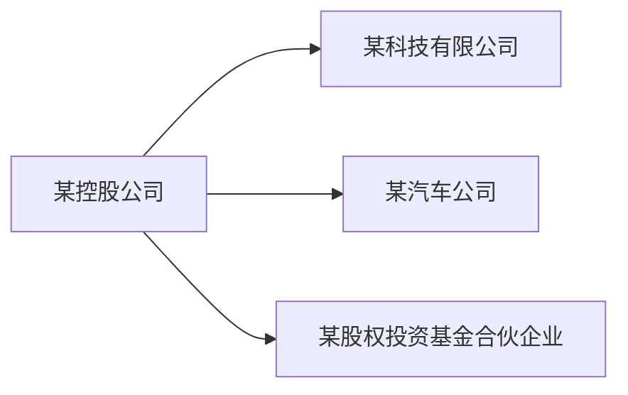
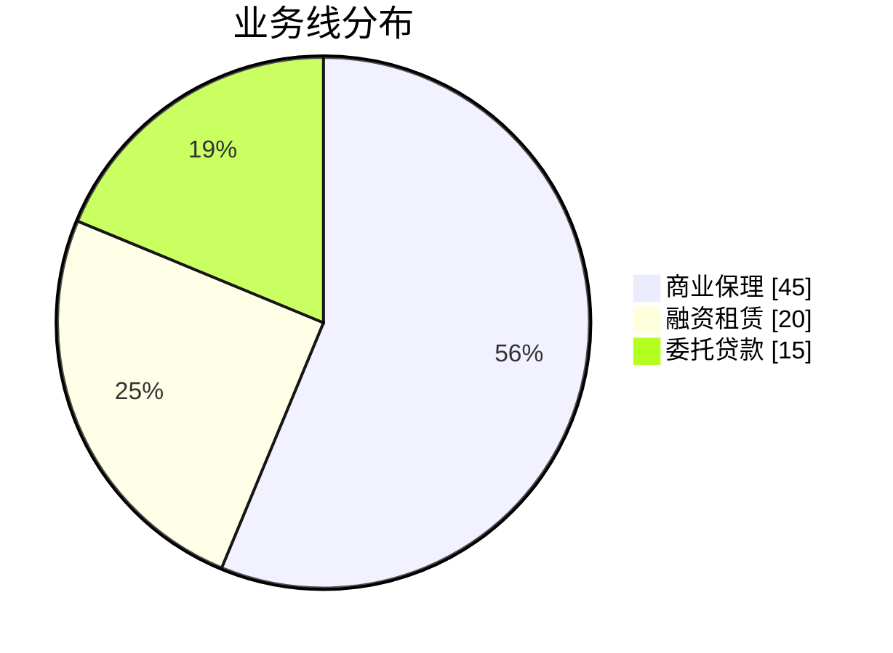
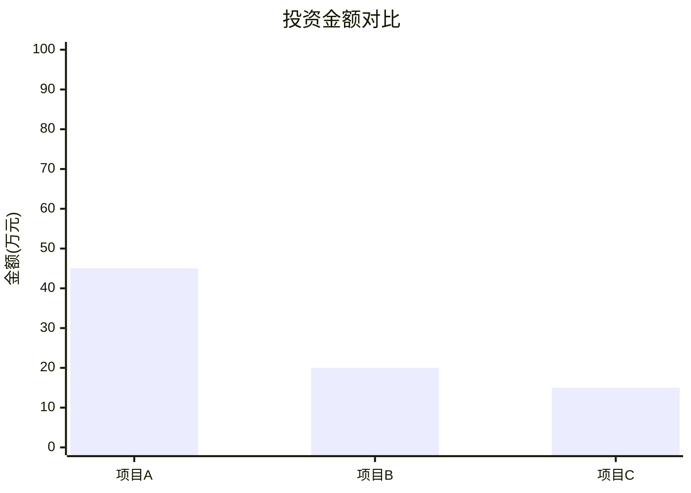

# Mermaid 图表生成规范 Skill

> **定位**：本技能是 **Mermaid 输出层的技术规范**，只负责"怎么把真实数据画成语法正确的 Mermaid 图"。它**不负责"怎么查"**（数据来源、工具路由见 `investment-dwd-query` skill），也**不负责"怎么答"**（见 A2 指令）。
>
> **使用时机**：当 A2 收到"图表/画图/饼图/柱状图/折线图/关系图/流程图/可视化"类请求、需要输出 Mermaid 代码时，**严格按本技能生成**，确保渲染成功。
>
> **铁律**：图中每个节点、关系、数值必须来自工具真实返回的 `data`，**禁止编造**节点或关系（与 A2 指令"数据真实性"一致）。

---

## 一、Mermaid 基本语法（必须遵守）

### 1.1 代码块包裹（必须）
Mermaid 代码必须放在 fenced code block 中，且语言标签必须是 `mermaid`：

````markdown
```mermaid
<此处是 Mermaid 代码>
```
````

> 错误示例（语言标签错/缺失会导致不渲染）：
> ````markdown
> ```mermaid
> graph ...
> ```
> ````

### 1.2 图表类型声明（第一行必须是类型）
第一行必须显式声明图表类型，常见：

| 图表类型 | 声明行 | 用途 |
|---------|--------|------|
| 流程图 | `flowchart LR` 或 `graph LR` | 关系图/流程 |
| 关系图 | `graph LR` | 投资方→被投方 |
| 饼图 | `pie` | 占比/分布 |
| 柱状图 | `xychart-beta` | 数值对比 |
| 折线图 | `xychart-beta` | 趋势 |

### 1.3 节点与标签（防格式错误核心）
- **节点文本含特殊符号（空格、括号、冒号、中文标点、`/`、`-`、`&` 等）时，必须用双引号包住**：
  ```
  A["某控股公司"] --> B["某科技有限公司"]
  ```
- **节点文本绝不能用单引号、绝不能用裸文本含 `(` `)` 不闭合**。
- 边符号：`-->`（有向）、`---`（无向）、`-.->`（虚线）。

---

## 二、各图表类型的推荐模板（可直接照抄替换数据）

### 2.1 关系图（graph，最常用，用于投资方→被投方）

**规则**：
- 每个**投资方**用一个节点，每个**被投方**用一个节点。
- **同一投资方 → 多个被投方**用多行 `投资方 --> 被投方`。
- 节点 label 用关键词或简称，**过长时用简称**（控制在 10 字内），避免节点过大。
- 数值/金额如需展示，写在边上：`INV -->|"投资 90万元"| P1`。

### 2.2 饼图（pie，用于占比/分布）

**规则**：
- 第一行 `pie`，可加 `showData` 显示具体数值。
- 每行格式：`"标签" : 数值`（数值为工具返回的计数或金额）。
- **标签用双引号**，数值用数字（无单位、无逗号）。

### 2.3 柱状图 / 折线图（xychart-beta，用于数值对比/趋势）

**规则**：
- `x-axis` 后跟中括号数组，元素用双引号。
- `bar`（柱状）或 `line`（折线）后跟数值数组。
- x 轴标签与数值数组**长度必须一致**，否则渲染失败。

---

## 三、常见错误与规避（Qwen 易犯）

| 错误 | 错误示例 | 正确写法 |
|------|---------|---------|
| 节点含括号未闭合 | `A(某控股公司(有限公司)` | `A["某控股公司(有限公司)"]` |
| 节点含中文逗号/冒号未引号 | `A(商业保理: 45)` | `A["商业保理: 45"]` |
| 饼图标签未加引号 | `商业保理 : 45` | `"商业保理" : 45` |
| 柱状图 x 轴与值长度不一致 | `x-axis ["A","B"]` + `bar [1,2,3]` | 长度必须相同 |
| 节点文本含 `&` 未转义 | `A(研发&销售)` | `A["研发 & 销售"]` |
| 混合 `graph` 和 `flowchart` 声明 | `graph flowchart LR` | 只写一种：`graph LR` |
| 值含单位/逗号 | `"商业保理" : 45万元` | `"商业保理" : 45` |

---

## 四、执行流程

1. **确认图表类型**：根据用户请求选类型（关系图/饼图/柱状图/折线图）。
2. **取真实数据**：数据必须来自本轮工具调用的 `data`（由投资查询 skill 提供）。
3. **按 §二 模板套用**：严格按对应类型的模板结构填写，不自行发明语法。
4. **自检格式**：对照 §三 错误表检查节点引号、标签引号、数组长度、类型声明。
5. **输出**：用 ` ```mermaid ... ``` ` 代码块包裹，配合简要说明。

---

## 边界与禁止

- **禁止编造**：图中节点/关系/数值必须来自工具真实返回的 `data`，禁止凭记忆或逻辑补全。
- **禁止发明不存在的 Mermaid 语法**：只使用 §二 模板中的标准语法。
- **禁止在图表中输出非数据字段**：如把"假设说明""诊断结论"塞进图。
- **复杂图表**：当数据量过大（>50 个节点）时，建议聚焦关键关系或分图，避免图过大渲染卡顿。